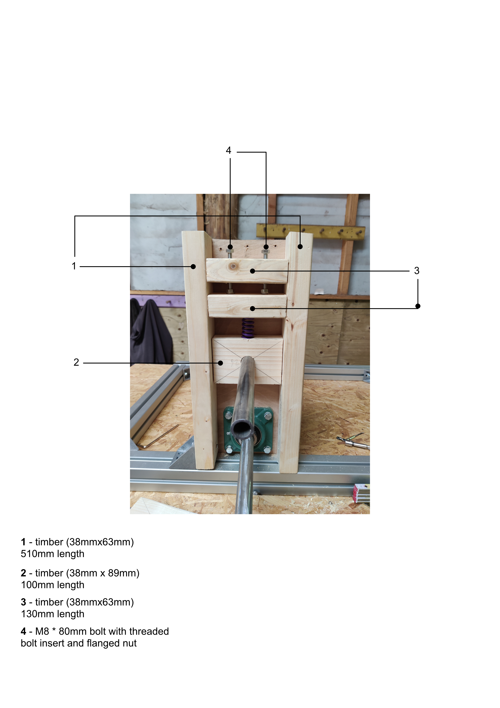
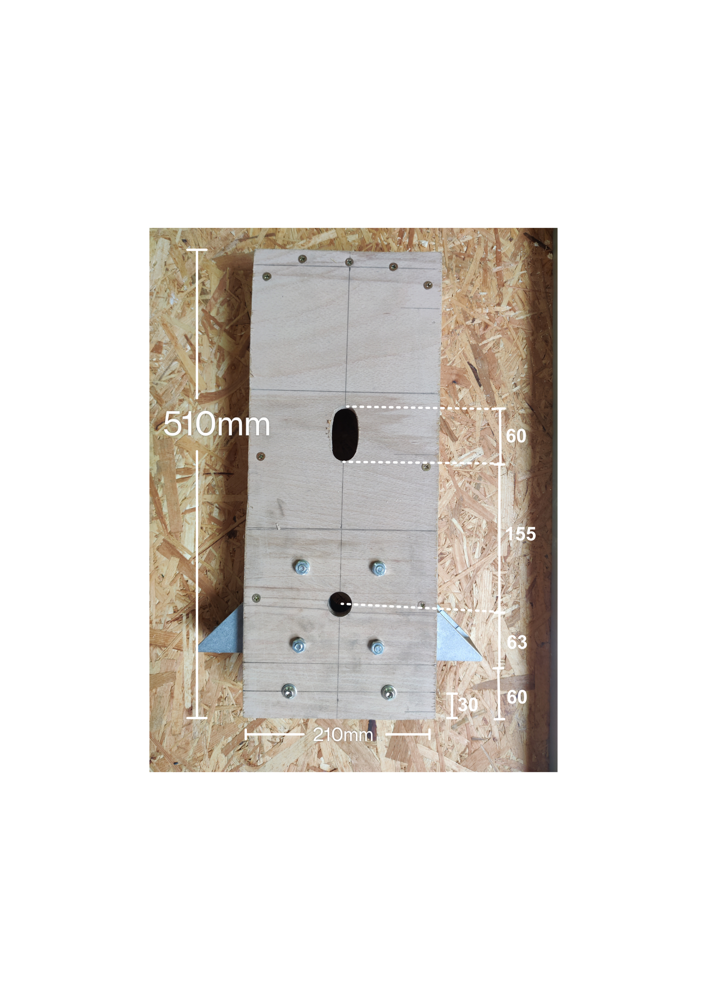
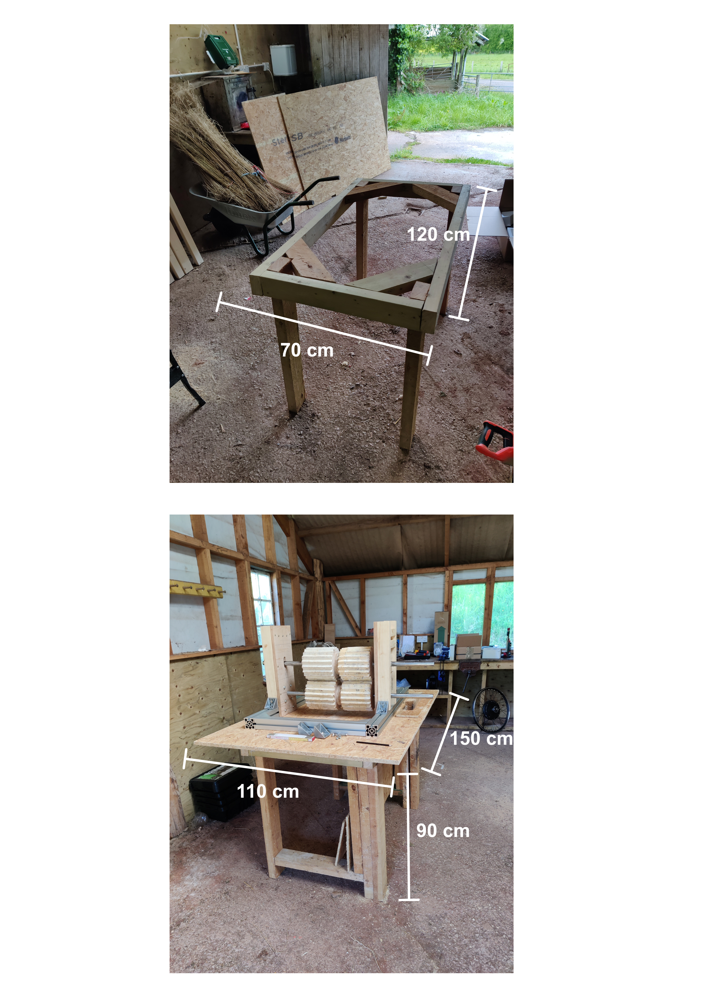

# flax-breaker
Flax Breaker

## Version 2

Since publishing the manual for Version 1 we have been working on some improvements.

Axle holder:

Measurements for the construction of the axle support. Note that the transmission sprocket sits in-front of it, outside of the extrusion frame. Top block (3) is placed 40mm below the top of the plywood backing.

The pressure on the spring will be provided by two M8 bolts fastened into a threaded insert. Be sure the M8 bolt penetrate into the bottom wooden block to ensure it cannot spring out. Place flanged nuts and washers on the M8 bolts to enable them to apply pressure to the bottom wooden block.

Layout of the breaker and rollers:

For transmission we switch from using a v-belt to using an O8B1 chain. 

There are two transmission mechanisms, one from the motor to the central axle, and one from the central axle to the two others. All transmissions are with 08B1 chain.

Table:

### Parts List (UK)

**Motor** 
- Motor (1500W ebike rear hub conversion kit with freehweel) ([Amazon](https://www.amazon.co.uk/dp/B0F4MY23LT?ref=ppx_yo2ov_dt_b_fed_asin_title))
- 48V 1500W power supply
- Emergency stop button ([Amazon](https://www.amazon.co.uk/gp/product/B07LFXB8PF/ref=ox_sc_act_title_2?smid=A1ZJKGYC1NCLC9&psc=1))
- 2 x Waterproof boxes for the electrics ([Amazon](https://www.amazon.co.uk/gp/product/B0FRNKJMFR/ref=ox_sc_act_title_4?smid=A1Y7ZINZ9CKS92&psc=1))
- 12 awg electric wire (black and red) ([Amazon](https://www.amazon.co.uk/Gruiqrd-Silicone-Electrical-Flexible-Temperature/dp/B0CZRGKBHH/ref=sr_1_4_pp?crid=25BK3QEE42MWJ&dib=eyJ2IjoiMSJ9.B2HSOxa6wjgNRyjCSxDWdoEojGJs7M-u2pxIdw0zZ5VyYOwBOX4NQ8GnO-QPcscD9n1_Bjjg_Ob9rWruZRc2qmEbo7wluuwWgKN4asrGeMnE2z12eDVQXcrkpO6b9GftNXrpcnyFivKQV3T9rQk5iDqfvOL1Rpe_DtT1sn4zOlW3VSHZNf9MC7cy4W2PbQrbyAiqCbabp0X2D3tQLXud4RnRAY8uNYylwzZqXd8NkaFjzP3PHlfDKrZyy0qGdoSTd-Y7hhrCHBSq54x5HVeg59Ftcd3Fy0ojDSqQZotaqds.dd_p8SBI8HkgYp7qWSc9dTVA4T04HpJkGG7UK1fhkAg&dib_tag=se&keywords=12%2Bawg%2Bwire&qid=1777391425&s=industrial&sprefix=12%2Bawg%2Bwi%2Cindustrial%2C415&sr=1-4&th=1))
- 2 x 35amp fuse ([Amazon](https://www.amazon.co.uk/gp/product/B0FV1PPHHS/ref=ox_sc_act_title_2?smid=A2U3HUDR85B7H0&psc=1))
- electric plug
- 3 core electric wire (16awg)
- 10K potentiometer ([Amazon](https://www.amazon.co.uk/gp/product/B095X7JQP9/ref=sw_img_1?smid=A2L9T8IGQDPJ43&th=1))

**Frame**
- 2 x 1000mm 60x60 aluminium extrusion (heavy version)
- 2 x 600mm 60x60 aluminium extrusion (heavy version)
- 20 x 60x60 backet (4 with fixings included)
- 30 x M8 T-nut     
- Plywood
- Stud timber

**Transmission**

For the motor:

- 20 teeth 08B1 Roller Chain Simplex Sprocket ([Bearing Boys](https://www.bearingboys.co.uk/08B1-12inch-Simplex-Sprockets/4120-Roller-Chain-Sprocket-6155-p))
- 1610 taperlock bush, 40mm bore size ([Bearing Boys](https://www.bearingboys.co.uk/1610-Taper-Bushes/161040-Taper-Bush-Dunlop-2316-p))
- 95 teeth 08B1 Roller Chain Spimplex Sprocket ([Bearing Boys](https://www.bearingboys.co.uk/08B1-12inch-Simplex-Sprockets/4195-Roller-Chain-Sprocket-6213-p))
- 2012 taperlock bush, 1 inch bore ([Bearing Boys](https://www.bearingboys.co.uk/2012-Taper-Bushes/20121-Taper-Bush-Dunlop-2373-p))
- 14 teeth 08B1 Roller Chain Simplex Sprocket ([Bearing Boys](https://www.bearingboys.co.uk/08B1-12inch-Simplex-Sprockets/4114-Roller-Chain-Sprocket-277052-p))
- 1008 taper bush 1 inch bore ([Bearing Boys](https://www.bearingboys.co.uk/1008-Taper-Bushes/10081-Dunlop-Taper-Bush-with-1inch-Bore-2216-p))
- 2 x 2 bolt flanged bearing, 1 inch bore ([Bearing Boys](https://www.bearingboys.co.uk/2-Bolt-Flanged-Bearings/UCFL20516-Dunlop-2-Bolt-Oval-Flange-Bearing-with-1inch-Bearing-Insert--10919-p))
- 200mm 1 inch mild steel tube

For the rollers:

- 4 x 30 teeth 08B1 Roller Chain Simplex Sprocket ([Bearing Boys](https://www.bearingboys.co.uk/08B1-12inch-Simplex-Sprockets/4130-Roller-Chain-Sprocket-6195-p))
- 4 x 2012 taperlock bush, 1 inch bore ([Bearing Boys](https://www.bearingboys.co.uk/2012-Taper-Bushes/20121-Taper-Bush-Dunlop-2373-p))
- 5m 08B1 chain
- 2 simplex connecting links
- 6 x 4 bolt square flanged bearing, 1 inch bore ([Bearing Boys](https://www.bearingboys.co.uk/4-Bolt-Flanged-Bearings/UCF213-Dunlop-4-Bolt-Square-Flanged-Bearing-with-65mm-Bearing-Insert-96630-p))

**Hardware**

- 6 x Springs 25mm hole diamter, 63.5mm Free length, 50N/mm([Lee Spring](https://www.leespring.co.uk/product/compression-spring-lhl1000b06-oil-tempered-chrome-silicon))
- Hardware (threaded rods, nuts, bolts)
  - M8 bolts
    - 12 x 25mm for angle bracket to frame connections
    - 12 x 30mm for plywood connections to frame
  - 12 x Self tapping threaded inserts for wood M8, 25mm length ([Accu](https://www.accu.co.uk/threaded-inserts-for-wood/649069-HCSTIF-M8-25-14-5-BZP))
  - 12 x M8 bolt, 80mm (aka wing screw) ([Accu](https://www.accu.co.uk/wing-screws/67321-SWI-M8-60-A2)) (or just m8 bolt)
  - 1m M8 threaded rod
  - 8 x M8 flanged nut (or nut + washer) ([Accu](https://www.accu.co.uk/metric-flanged-hexagon-nuts/409654-HFFN-M8-A2))
  - 6mm screws
  - 12 x M8 bolt 50mm 
  - 12 x M8 lock nut
  - 6 x 1 inch bore shaft collars

**Rollers** 
- 2 sheets 18mm plywood
- 48 x 4.8mm phillips wood screws 100mm 
- 24 x 8mm, 200mm mild steel rod
- Epoxy glue

## Version 1

### Parts List (UK)
Note the Bearing Boys site seems not to like links, so you need to copy/paste the url.

- Single taperlock pulley: https://www.bearingboys.co.uk/SPA-Section-Cast-Iron--Taper-Lock/SPA10611610-Dunlop-Taperlock-V-Pulley-4251-p
- Double taperlock pulley: https://www.bearingboys.co.uk/SPA-Section-Cast-Iron--Taper-Lock/SPA10621610-Dunlop-Taperlock-V-Pulley-4252-p)
- V-Belt: https://www.bearingboys.co.uk/A-Belts-13mm-x-8mm/A28-Dunlop-V-Belt--106-p
- Taper Bush: https://www.bearingboys.co.uk/1610-Taper-Bushes/16101-Taper-Bush-Dunlop-2322-p
- [Metal axles](https://www.metals4u.co.uk/materials/mild-steel/mild-steel-tube/2333-p)
- [E-bike motor](https://www.ebay.co.uk/itm/387663956164?var=654901616184): 48V, 2000W
- [Power supply](https://www.aliexpress.com/item/1005008347577591.html?spm=a2g0o.order_list.order_list_main.5.4e8a18020Ag0ux): 2000W, 48V switching power supply
- Custom connector can be purchase from Fantasy Fibre Mill to attach instead of freewheel to e-bike motor. This allows you to choose a custom sprocket or pulley to connect the central breaker axle to the e-bike motor.
