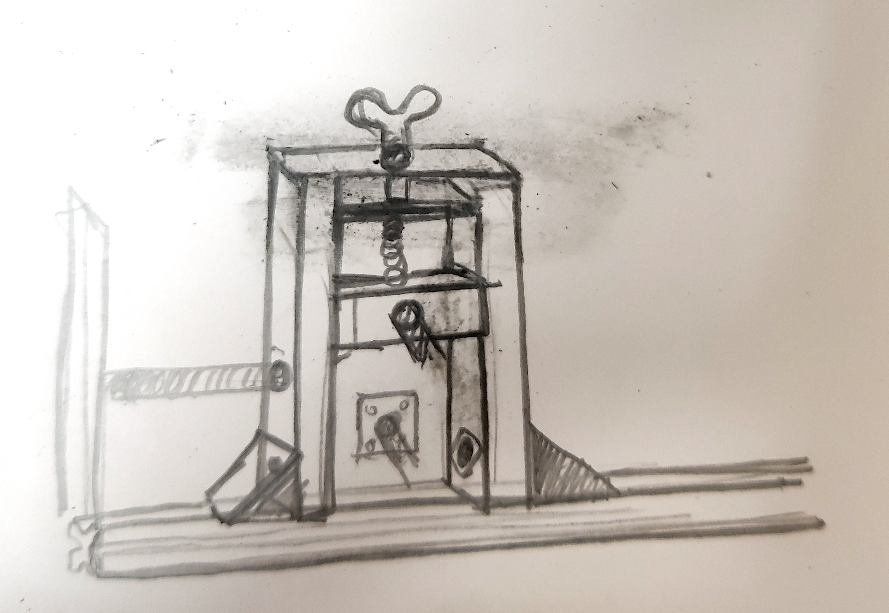
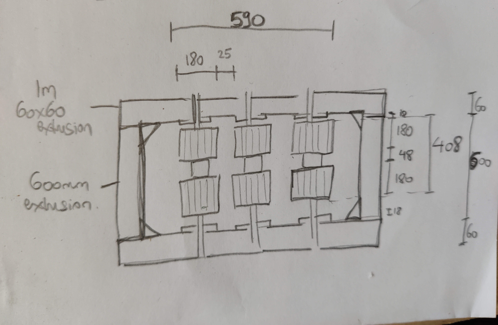
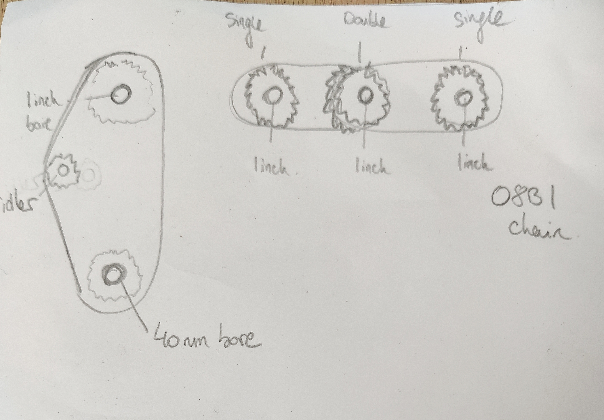

# flax-breaker
Flax Breaker

## Version 2

Since publishing the manual for Version 1 we have been working on some improvements.

We will try to build an axle support using only extrusion bar on the bottom and a combination of plywood and 38x63mm studwork timber, here is a rough sketch:

This will save on expensive 60x60 aluminium extrusion and be easier to build and adjust. Note the threaded rod that is placed between adjacent support to tension the chain. We will also switch from using a v-belt to using an O8B1 chain. 

The pressure on the spring will be provided by a winged bolt fastened into a threaded insert.

Layout of the breaker and rollers:

There are two transmission mechanisms, one from the motor to the central axle, and one from the central axle to the two others. All transmissions are with 08B1 chain.

### Parts List (UK)

**Motor** 
- Motor (1500W ebike rear hub conversion kit with freehweel)
- 48V 1500W power supply

**Frame**
- 2 x 1000mm 60x60 aluminium extrusion (heavy version)
- 2 x 600mm 60x60 aluminium extrusion (heavy version)
- 20 x 60x60 backet (4 with fixings included)
- 30 x M8 T-nut     
- Plywood
- Stud timber

**Transmission**
For the motor:
- 20 teeth 08B1 Roller Chain Simplex Sprocket ([Bearing Boys](https://www.bearingboys.co.uk/08B1-12inch-Simplex-Sprockets/4120-Roller-Chain-Sprocket-6155-p))
- 1610 taperlock bush, 40mm bore size ([Bearing Boys](https://www.bearingboys.co.uk/1610-Taper-Bushes/161040-Taper-Bush-Dunlop-2316-p))
- 95 teeth 08B1 Roller Chain Spimplex Sprocket ([Bearing Boys](https://www.bearingboys.co.uk/08B1-12inch-Simplex-Sprockets/4195-Roller-Chain-Sprocket-6213-p))
- 2012 taperlock bush, 1 inch bore ([Bearing Boys](https://www.bearingboys.co.uk/2012-Taper-Bushes/20121-Taper-Bush-Dunlop-2373-p))

For the rollers:
- 4 x 30 teeth 08B1 Roller Chain Simplex Sprocket ([Bearing Boys](https://www.bearingboys.co.uk/08B1-12inch-Simplex-Sprockets/4130-Roller-Chain-Sprocket-6195-p))
- 4 x 2012 taperlock bush, 1 inch bore ([Bearing Boys](https://www.bearingboys.co.uk/2012-Taper-Bushes/20121-Taper-Bush-Dunlop-2373-p))
- 5m 08B1 chain
- 2 simplex connecting links

- 6 x 4 bolt square flanged bearing, 1 inch bore ([Bearing Boys](https://www.bearingboys.co.uk/4-Bolt-Flanged-Bearings/UCF213-Dunlop-4-Bolt-Square-Flanged-Bearing-with-65mm-Bearing-Insert-96630-p))

**Hardware**
- Springs
- Hardware (threaded rods, nuts, bolts)
  - M8 flanged nut
  - M8 bolts
    - 12 x 20mm for angle bracket to frame connections
    - 12 x 22mm for plywood connections to frame
- Bearings

**Rollers*
- 2 sheets 18mm plywood

## Version 1

### Parts List (UK)
Note the Bearing Boys site seems not to like links, so you need to copy/paste the url.

- Single taperlock pulley: https://www.bearingboys.co.uk/SPA-Section-Cast-Iron--Taper-Lock/SPA10611610-Dunlop-Taperlock-V-Pulley-4251-p
- Double taperlock pulley: https://www.bearingboys.co.uk/SPA-Section-Cast-Iron--Taper-Lock/SPA10621610-Dunlop-Taperlock-V-Pulley-4252-p)
- V-Belt: https://www.bearingboys.co.uk/A-Belts-13mm-x-8mm/A28-Dunlop-V-Belt--106-p
- Taper Bush: https://www.bearingboys.co.uk/1610-Taper-Bushes/16101-Taper-Bush-Dunlop-2322-p
- [Metal axles](https://www.metals4u.co.uk/materials/mild-steel/mild-steel-tube/2333-p)
- [E-bike motor](https://www.ebay.co.uk/itm/387663956164?var=654901616184): 48V, 2000W
- [Power supply](https://www.aliexpress.com/item/1005008347577591.html?spm=a2g0o.order_list.order_list_main.5.4e8a18020Ag0ux): 2000W, 48V switching power supply
- Custom connector can be purchase from Fantasy Fibre Mill to attach instead of freewheel to e-bike motor. This allows you to choose a custom sprocket or pulley to connect the central breaker axle to the e-bike motor.
